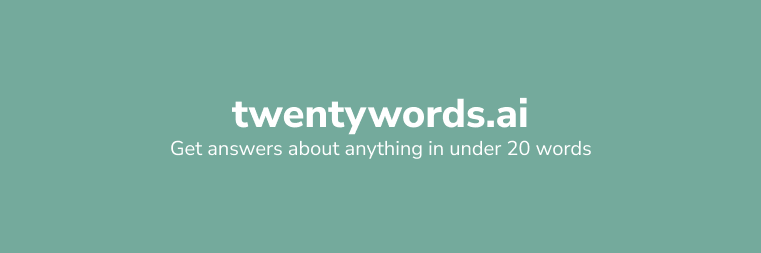

  

No signup, no login, no paywall, no ads.

## Who is this for?

I introduced my parents to GPT a couple of months ago and they have been active users of it since then. They use it from official work to sending informal messages in their Whatsapp groups.

I observed their usage and they often had to ask GPT to reduce the text size as it gave very elaborate response. This app aims to solve that for them and for other parents who want to access some information real quick and in a concise way.

This is also useful for people who:

- Want to learn a new language's word everyday
- Are in a meeting, and quickly want to understand a word
- Want to quickly get a summary of any textual message

## Special Mentions

- [Vibhuti Arora](linkedin.com/in/vibhuti-arora-501569225/) for being a critic to my initial designs! (She still hates them :))
- [Rishabh Keshan](https://www.linkedin.com/in/rishabhkeshan/) for helping with frontend UI bugs! (If its buggy, its not me xD)

Made to explore NextJs & OpenAI :computer:

